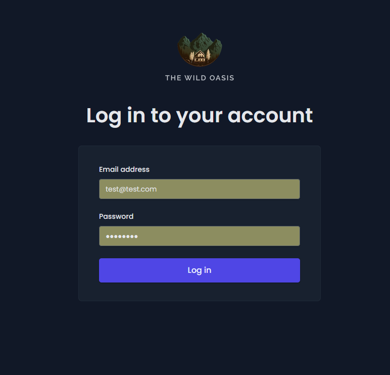
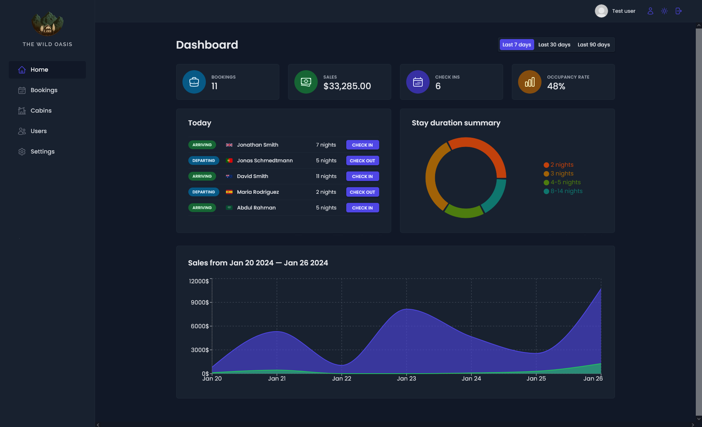
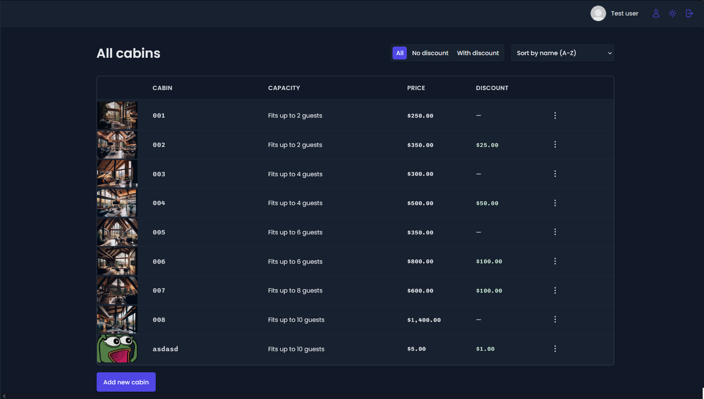
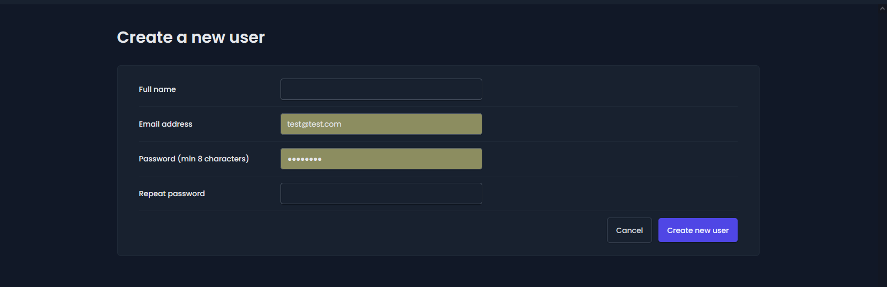
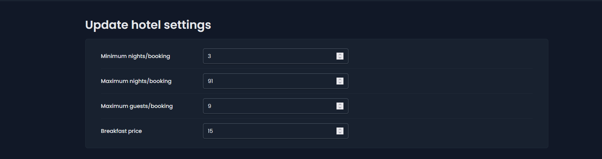
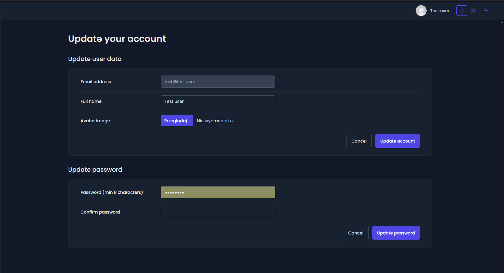

<p align="center">
  
</p>

# WildHotel

Website dedicated to the hotel. Manage it using many options, such as adding rooms, adding users, viewing current reports, or bookings.

# Features

## 🔐 Login

Log in to use the application. Test account: email: test@user.com, password: testuser


## 📊 Dashboard

View reports for the last 7, 30 or 90 days. Various charts will help you with this.




## 📖 Bookings

Browse all bookings and filter them to make it easier to find them.


## ☀️🌙 Theme Changer

Using the button, we can change the entire application theme with one click.


## 🏚️ Cabins

Browse current cabins, remove them and add new ones.



## 🧍‍♂️🧍‍♂️ Users

Add new users.


## ⚙️ Settings

Change the hotel settings to suit your convenience.


## 🧑‍🦲 Account

Update your account - change your username, avatar or password


# 🚀 Demo

You can see the application at
https://windue-mo.netlify.app/

# 🛠️ Run Locally

Make sure you have Node and npm installed (https://nodejs.org/en)

Clone the project

```bash
  git clone https://github.com/dosmiko7/WildHotel
```

Go to the project directory

```bash
  cd WildHotel
```

Install dependencies

```bash
  npm install
```

Start the server

```bash
  npm run dev
```

To login we can use this account:
login: test@test.com
password: testuser

# 💻 Tech Stack

- Node v18.14.2,
- npm v9.8.0,
- Vite,
- React,
- JavaScript,
- React Query,
- React Router,
- Styled components,
- React Hot Toast,
- React Form Hook,
- Recharts,
- Supabase

## 👨‍💻 Author

Mikołaj Oberda
[@dosmiko7](https://www.github.com/dosmiko7)

Based on the course of [@Jonas Schmedtmann](https://www.udemy.com/user/jonasschmedtmann/)
